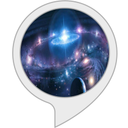

# Horoscope-3.1

## Description
> This skill will tell your zodiac sign on the basis of your date of birth and also some beneficial and interesting information about yourself.       

Tell alexa about your date of birth in this format: "Date Month". for example- `3 December`.
Then alexa will tell your zodiac sign.

Simply say `describe me`. Alexa will provide following information about you:
1. Lucky color
2. Lucky number
3. Lucky day
4. Best match
5. Strengths
6. Weaknesses
7. Likes
8. Dislikes 
9. Personality

## Supported Languages
- English (AU) 
- English (CA)
- English (GB)
- English (IN)
- English (US)

## How to start?
1. Enable the [skill](https://www.amazon.com/Mohit-arora-Horoscope-3-1/dp/B07DBS811V/ref=sr_1_1?ie=UTF8&qid=1550779139&sr=8-1&keywords=horoscope+3.1).
2. Download [Amazon Alexa App](https://play.google.com/store/apps/details?id=com.amazon.dee.app&hl=en_IN).
3. Login with Amazon account.
4. Tap to middle icon and say `Alexa, open static horoscope`.

Enable it [now](https://www.amazon.com/Mohit-arora-Horoscope-3-1/dp/B07DBS811V/ref=sr_1_1?ie=UTF8&qid=1550779139&sr=8-1&keywords=horoscope+3.1)
